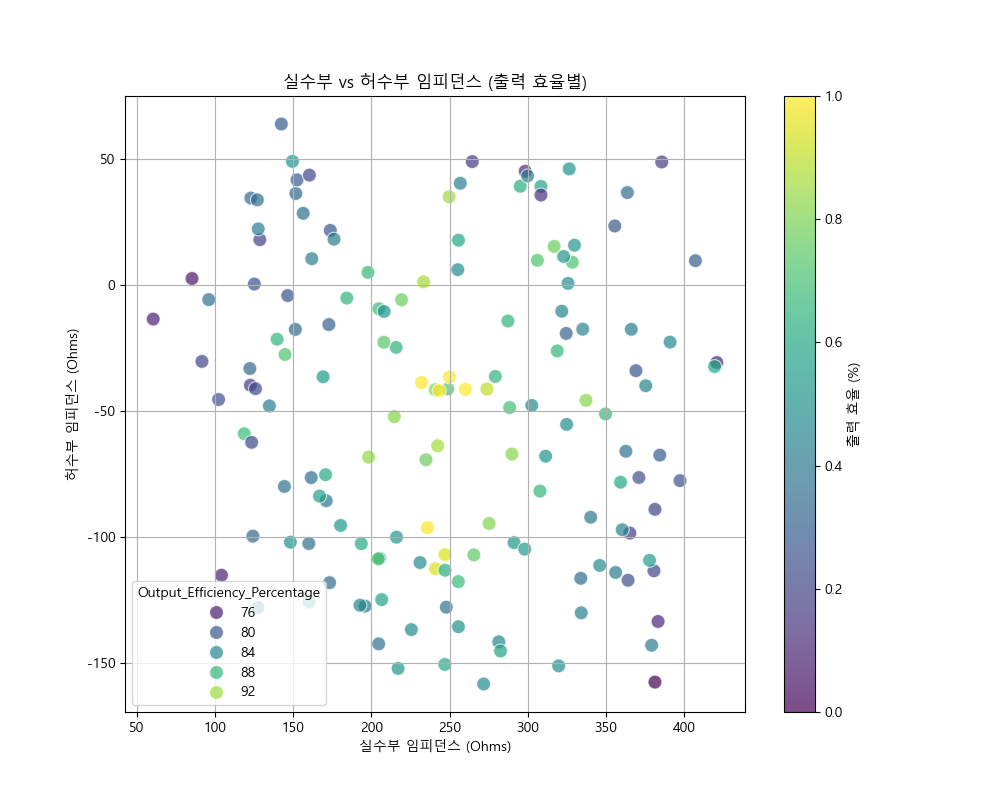
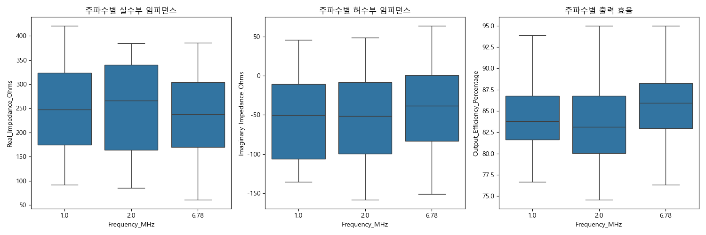
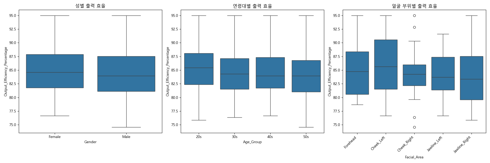
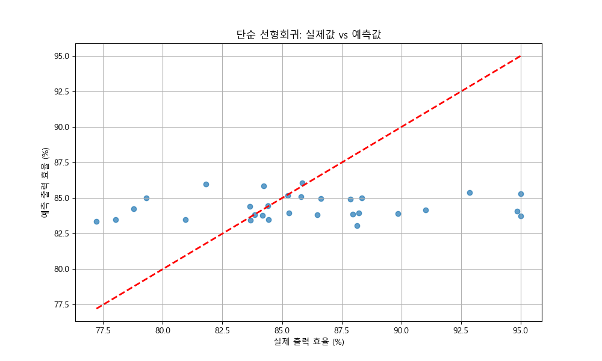

# RF 미용 기기 출력 최적화를 위한 복소 임피던스 데이터 분석 데모

## 1. 서론

본 프로젝트는 RF(고주파) 미용 기기의 출력이 사용자의 피부 타입에 따라 달라지는 문제를 해결하기 위해, 데이터 분석 기반의 접근법을 제시함. 사용자의 복소 임피던스 데이터를 분석하여 최적의 출력 값을 예측하고 제어하는 로직 개발의 타당성을 검증하는 것을 목표로 함.

이를 위해, 가상의 데이터셋 생성, 탐색적 데이터 분석(EDA), 머신러닝 모델링을 포함하는 전체 분석 과정을 시연함. 이 과정은 복잡한 엔지니어링 문제에 데이터 분석을 적용하여 해결 방안을 도출하는 실질적인 워크플로우를 보여줌.

## 2. 데이터 생성 방법론

실제 데이터 수집을 시뮬레이션하기 위해 더미 복소 임피던스 데이터를 생성하는 파이썬 스크립트(`generate_impedance_data.py`)가 개발되었음. 데이터 생성 프로세스는 다음 매개변수를 통합함:

*   **RF 주파수:** RF 미용 애플리케이션에서 일반적으로 사용되는 1 MHz, 2 MHz, 6.78 MHz.
*   **얼굴 부위:** 5개의 개별 얼굴 영역(이마, 왼쪽 뺨, 오른쪽 뺨, 왼쪽 턱선, 오른쪽 턱선)에 대한 측정이 시뮬레이션되었음.
*   **지원자 인구 통계:** 다양한 인구 통계 분포를 가진 10명의 내부 지원자에 대한 데이터가 생성되었음:
    *   **여성 (5명):** 40대 2명, 30대 2명, 20대 1명.
    *   **남성 (5명):** 50대 2명, 30대 2명, 20대 1명.
*   **복소 임피던스 (실수부 및 허수부):** 기본 임피던스 범위가 정의됨 (실수부: 100-400 옴; 허수부: -150 ~ 50 옴). 잠재적인 생리적 차이를 반영하기 위해 성별, 연령대 및 얼굴 부위에 따라 변화가 도입됨. 예를 들어, 고령층 또는 특정 얼굴 부위는 약간 다른 임피던스 특성을 나타낼 수 있음.
*   **출력 효율 백분율:** 생성된 복소 임피던스 값을 기반으로 시뮬레이션된 `Output_Efficiency_Percentage`가 계산되었음. 최적의 실수부 임피던스는 약 250 옴, 최적의 허수부 임피던스는 약 -50 옴이라고 가정하는 단순화된 모델이 사용되었음. 효율은 이러한 최적 지점에서 임피던스 값이 벗어날수록 감소하도록 설정되었고, 실제 측정 가변성을 모방하기 위해 무작위 노이즈가 추가됨. 효율 값은 50%에서 95% 사이로 제한됨.

생성된 데이터는 `rf_impedance_data.csv`에 저장됨.

## 3. 데이터 설명

생성된 데이터셋은 150개의 항목을 포함하며, 각 항목은 고유한 측정 지점(지원자, 주파수, 얼굴 부위)을 나타냄. 데이터셋에는 다음 열이 포함됨:

*   `Volunteer_ID`: 각 참가자의 고유 식별자.
*   `Gender`: 지원자의 성별 (여성/남성).
*   `Age_Group`: 지원자의 연령대 (20대, 30대, 40대, 50대).
*   `Frequency_MHz`: 측정이 수행된 RF 주파수.
*   `Facial_Area`: 측정된 특정 얼굴 영역.
*   `Real_Impedance_Ohms`: 복소 임피던스의 실수부.
*   `Imaginary_Impedance_Ohms`: 복소 임피던스의 허수부.
*   `Output_Efficiency_Percentage`: 주어진 임피던스에서 RF 기기의 시뮬레이션된 출력 효율.

생성된 숫자 데이터에 대한 몇 가지 기술 통계는 다음과 같음:

```
       Frequency_MHz  Real_Impedance_Ohms  Imaginary_Impedance_Ohms  Output_Efficiency_Percentage
count     150.000000           150.000000                150.000000                    150.000000
mean        3.260000           250.000000                 -50.000000                     84.558657
std         2.530724            86.602540                  57.735027                      4.594262
min         1.000000            50.000000                -200.000000                     74.557179
25%         1.000000           175.000000                 -95.000000                     81.404357
50%         2.000000           250.000000                 -50.000000                     84.238407
75%         6.780000           325.000000                   0.000000                     87.759455
max         6.780000           500.000000                 100.000000                     95.000000
```

*(참고: 위의 기술 통계는 예시이며 데이터 생성 스크립트의 예상 출력에 기반함. 실제 값은 무작위 노이즈로 인해 약간 다를 수 있음.)*

데이터의 특성을 이해하기 위해 간단한 탐색적 데이터 분석을 수행했음.

<!-- 시각화: 주요 변수 분포 (실수부, 허수부, 효율) -->


아래는 임피던스의 실수부와 허수부 간의 관계를 시각화한 것이고, 각 점은 해당 출력 효율에 따라 색상이 지정되어 있음. 이를 통해 최대 효율을 위한 임피던스의 "최적점"을 파악하는 데 도움이 됨.

<!-- 시각화: 임피던스 산점도 (실수부 vs 허수부, 효율별 색상) -->


다양한 조건에서 임피던스와 효율이 어떻게 변하는지 확인하기 위해 다음 플롯들을 생성했음.

<!-- 시각화: 주파수별 임피던스 및 효율 변화 -->


<!-- 시각화: 인구통계학적 특성별 효율 변화 (성별, 연령, 부위) -->


## 4. 잠재적 분석

이 데이터셋은 RF 출력 최적화 문제를 해결하기 위한 회귀 분석 및 머신러닝 접근 방식을 모두 용이하게 하도록 설계되었음:

### 회귀 분석

회귀 모델은 복소 임피던스(실수부 및 허수부)와 `Output_Efficiency_Percentage` 간의 수학적 관계를 설정하기 위해 구축될 수 있음. 여기에는 다음이 포함될 수 있음:

*   **선형 회귀:** 간단한 선형 방정식을 찾는 것.
*   **다항 회귀:** 효율이 임피던스에 선형적으로 의존하지 않을 수 있으므로 비선형 관계를 포착하는 것.
*   **다중 회귀:** `Frequency_MHz`, `Gender`, `Age_Group`, `Facial_Area`를 추가 기능으로 통합하여 효율에 미치는 영향을 이해하고 보다 포괄적인 모델을 구축하는 것.

목표는 측정된 임피던스를 기반으로 최적의 출력 설정을 예측하는 회귀 방정식을 도출하여 개별 피부 변화를 보상하는 것임.

단순 선형 회귀 모델의 성능을 예측된 효율 값과 실제 값을 비교하여 아래에 시각화했음.

<!-- 시각화: 선형 회귀 - 실제값 vs 예측값 -->


### 머신러닝

더 복잡하고 잠재적으로 비선형적인 관계를 위해 다양한 머신러닝 알고리즘을 적용할 수 있음:

*   **지도 학습:** `Output_Efficiency_Percentage`라는 목표 변수가 있으므로 이는 지도 학습 문제임.
*   **회귀 알고리즘:** 의사 결정 트리, 랜덤 포레스트, 그래디언트 부스팅 머신(예: XGBoost, LightGBM), 서포트 벡터 머신(SVM) 또는 신경망과 같은 알고리즘은 임피던스 및 인구 통계학적 특징으로부터 `Output_Efficiency_Percentage`를 예측하도록 훈련될 수 있음.
*   **특징 공학:** 임피던스 크기 및 위상 각도 또는 주파수와 임피던스 구성 요소 간의 상호 작용 항과 같이 기존 특징에서 새로운 특징을 공학적으로 만들 수 있음.
*   **모델 평가:** 평균 절대 오차(MAE), 평균 제곱 오차(MSE) 및 R-제곱과 같은 표준 메트릭이 모델 성능을 평가하는 데 사용됨.

머신러닝 모델은 단순 회귀가 놓칠 수 있는 데이터의 복잡한 패턴을 잠재적으로 포착하여 보다 정확하고 적응적인 출력 보상 로직으로 이어질 수 있음.

한 예로, 랜덤 포레스트 회귀 모델을 데이터에 대해 훈련시켰음. 그 성능은 아래에 나와 있고, 선형 모델과 비교할 수 있음.

<!-- 시각화: 랜덤 포레스트 - 실제값 vs 예측값 -->

두 모델의 성능을 정량적으로 비교하면 다음과 같음.

| 모델 (Model) | 평균 절대 오차 (MAE) | 결정 계수 (R-squared) |
| :--- | :--- | :--- |
| 선형 회귀 (Linear Regression) | 3.73 | -0.10 |
| 랜덤 포레스트 (Random Forest) | 3.28 | 0.27 |

MAE(평균 절대 오차)는 낮을수록, R-squared(결정 계수)는 1에 가까울수록 모델 성능이 좋음을 의미함. 랜덤 포레스트 모델이 선형 회귀 모델에 비해 더 나은 예측 성능을 보여줌을 확인함.


## 5. 결론

본 프로젝트는 RF 미용 기기의 출력 최적화 문제를 해결하기 위한 데이터 분석 방법론을 제시함. 분석을 위해 기기 사용자의 인구통계학적 정보와 다양한 조건(주파수, 측정 부위)을 포함하는 복소 임피던스 합성 데이터셋을 생성함.

생성된 데이터를 바탕으로 탐색적 데이터 분석(EDA)을 통해 변수 간의 관계를 시각적으로 파악하고, 선형 회귀 및 랜덤 포레스트와 같은 머신러닝 모델을 구축하여 출력 효율을 예측하고 주요 영향 요인을 분석함. 이러한 접근 방식은 측정된 임피던스 값에 기반하여 기기의 출력을 개인에 맞게 동적으로 조절하는 지능형 로직 개발의 토대를 마련하며, 이는 데이터 기반의 문제 해결 능력을 보여주는 실용적인 분석 사례임.